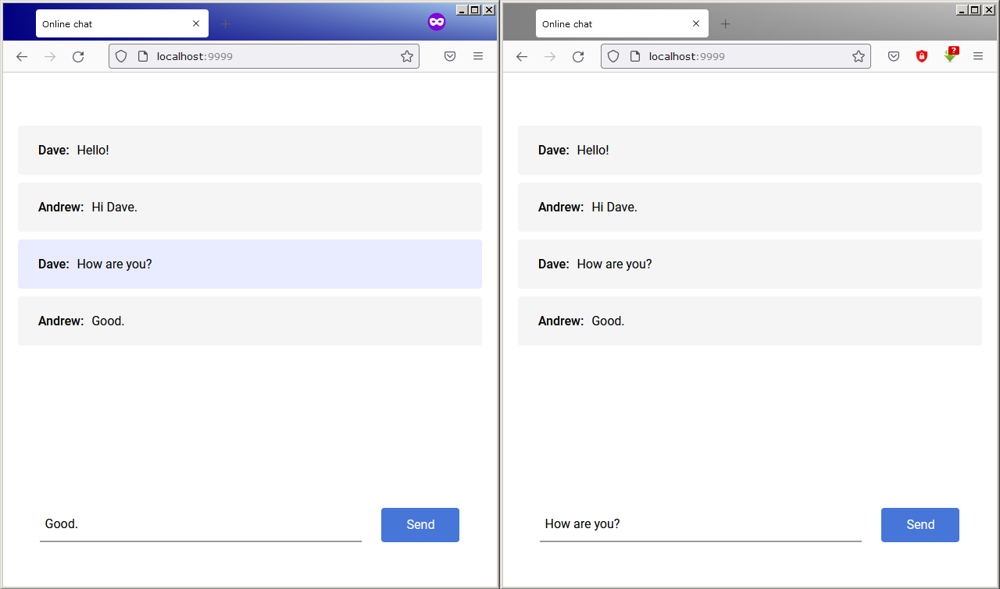

# Онлайн чат на Python
## За основу взята библиотека aiohttp и ее инструмент WebSocket

Позволяет обмениватся текстовыми сообщениями между клиентами. Перед началом переписки нужно ввести свой ник.

